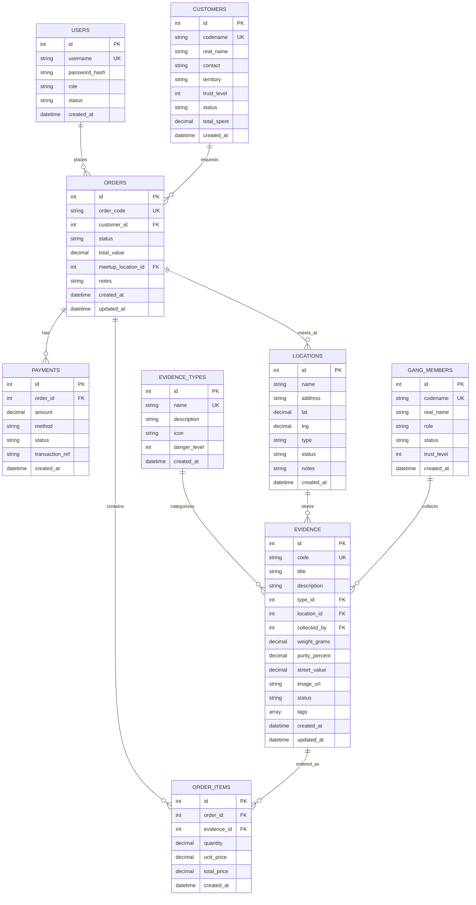

# Heisenberg Evidence & Distribution Network

A full-stack evidence management and distribution tracking system built with **React + shadcn-style UI**, **Go + Gin**, and **PostgreSQL**. Styled with a gritty Breaking Bad / Schedule 1 aesthetic — graffiti typography, hazard stripes, chemical green accents, and desert tones.

> **Disclaimer**: This is a fictional educational project themed after the TV show Breaking Bad and the video game Schedule 1. All characters, locations, and scenarios are fictional.

---

## Quick Start

One command from the project root:

```bash
docker compose up -d
```

Then open **http://localhost:8080**

Then open **http://localhost:8080**

Demo login:
- `heisenberg` / `blue`
- `jesse` / `blue`
- `mike` / `blue`

---

## E-R Diagram



---

## Architecture

```
/frontend    React 18 + Vite + TypeScript + Tailwind CSS + shadcn-style components
/backend     Go 1.22 + Gin + pgx (PostgreSQL driver)
/infra       docker-compose.yml (PostgreSQL + Go backend)
```

### Frontend
- **React 18** with hooks and functional components
- **React Router** for SPA navigation
- **Tailwind CSS v4** with custom theme tokens (Breaking Bad color palette)
- **shadcn/ui-inspired** component patterns (custom built for this theme)
- **Lucide React** for icons
- **Google Fonts**: Permanent Marker (graffiti display) + Rubik (body)

### Backend
- **Go 1.22** with **Gin** web framework
- **pgx/v5** for PostgreSQL connectivity
- **Embedded static files** via `//go:embed`
- **Auto-migrations** on startup with seed data
- **Demo auth** with bcrypt (password: `blue` for all demo accounts)

### Database
- **PostgreSQL 16** (Alpine)
- 8 tables: `users`, `customers`, `evidence_types`, `locations`, `gang_members`, `evidence`, `orders`, `order_items`, `payments`
- Pre-seeded with Breaking Bad themed data

---

## Features

### Evidence Vault
- Browse all evidence items with search, type filtering, and status filtering
- View detailed evidence cards with purity, weight, street value, and tags
- Chemical-themed color coding based on danger level

### Order Ledger
- Full order management system with status workflow
- Create orders with multiple items from evidence inventory
- Assign meetup locations
- Record payments (cash, crypto, wire, barter)
- Status tracking: pending → confirmed → in_transit → delivered

### Client Network
- Customer directory with trust levels (1-10 star rating)
- Territory and contact tracking
- Total spend history
- Status indicators: active, flagged, burned, deceased

### Meetup Grid
- Interactive map with all operational locations
- Location types: lab, stash, dead_drop, safe_house, meeting_spot
- Status tracking: active, busted, abandoned
- OpenStreetMap integration

### Dashboard
- Real-time stats: inventory value, purity averages, active orders, revenue
- Recent orders and fresh evidence feeds
- Hazard stripe branding elements

---

## Design System

### Colors
- **Background**: `#0d0d0d` (near-black)
- **Primary**: `#2d6a2d` (Breaking Bad green)
- **Accent**: `#c2a060` (desert sand/gold)
- **Destructive**: `#8b0000` (blood red)
- **Warning**: `#cc7a00` (hazard orange)

### Typography
- **Display**: `Permanent Marker` — graffiti-style headings
- **Body**: `Rubik` — clean, readable sans-serif

### Patterns
- Hazard stripe accents (45-degree orange/black stripes)
- Chemical glow text shadows on headings
- Dark card surfaces with subtle borders
- No emojis — pure iconography via Lucide

---

## API Endpoints

| Method | Endpoint | Description |
|--------|----------|-------------|
| POST | `/api/login` | Demo authentication |
| GET | `/api/me` | Current user |
| GET | `/api/stats` | Dashboard statistics |
| GET/POST/PUT/DELETE | `/api/evidence` | Evidence CRUD |
| GET | `/api/evidence-types` | Evidence categories |
| GET | `/api/locations` | All locations |
| GET | `/api/gang-members` | Crew roster |
| GET/POST/PUT/DELETE | `/api/customers` | Customer CRUD |
| GET/POST/PUT/DELETE | `/api/orders` | Order management |
| GET/POST/PUT | `/api/payments` | Payment processing |
| GET | `/api/health` | Health check |

---

## Development

### Frontend only (with local backend proxy)
```bash
cd frontend
npm run dev
```

### Backend only
```bash
cd backend
go run .
```

### Full stack (Docker)
```bash
docker compose up --build
```

---

## License

MIT — For educational purposes only.
